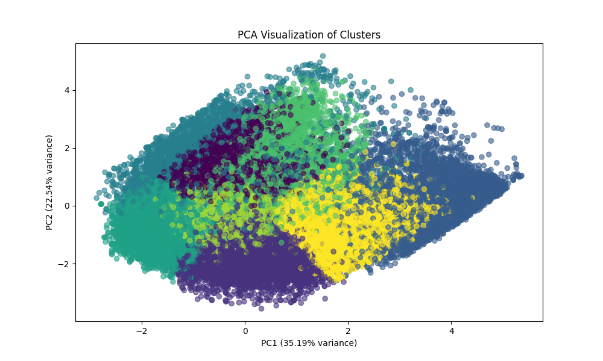
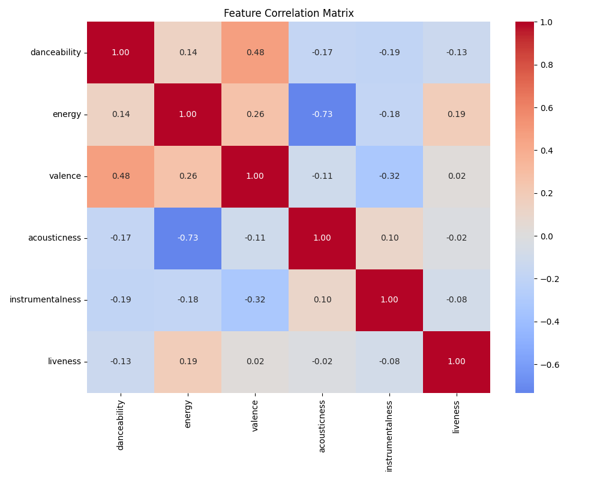
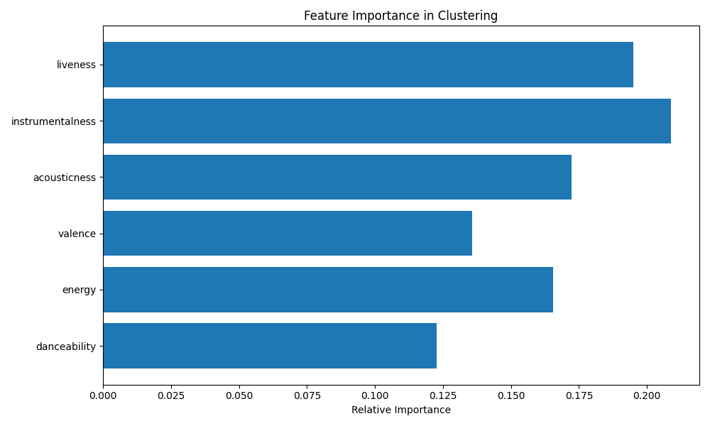
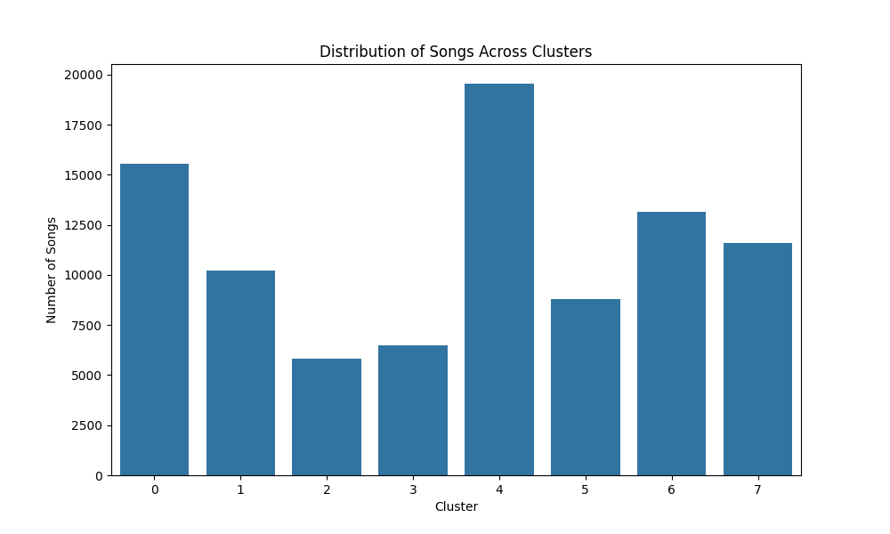

# Predictify: Music Recommendation System

## Project Description

Predictify is a web application designed to recommend new tracks to users based on their musical preferences. While earlier versions relied on the Spotify Web API for training data, the current system utilizes a curated, static dataset of Spotify tracks. By integrating all data and model training directly into the application, the recommendation engine—combining K-means clustering and content-based similarity—operates independently of external data sources, improving reliability and reproducibility.

**Primary Goal**: Suggest songs that resemble a chosen track, guided by acoustic features and genre tags.

**Specific Goals**:

1. Use a static dataset of Spotify tracks (including audio features) to train and evaluate the recommendation model.
2. Analyze a selected track’s audio profile (e.g., danceability, energy, valence) to guide recommendations.
3. Employ a hybrid approach that unites cluster-based similarity with direct feature-to-feature (cosine) similarity.
4. Implement a user-friendly interface for searching tracks, exploring their attributes, and viewing recommendations.

## Table of Contents

- [Data](#data)
- [Features](#features)
- [Tech Stack](#tech-stack)
- [Setup and Installation](#setup-and-installation)
- [How It Works](#how-it-works)
- [Results](#results)
- [Development Notes](#development-notes)
- [Future Improvements](#future-improvements)
- [Conclusion](#conclusion)

## Data

The system relies on a [Kaggle dataset](https://www.kaggle.com/datasets/maharshipandya/-spotify-tracks-dataset/data) of over 100,000 Spotify tracks, each with comprehensive audio features. This static dataset allows the model to be trained and tested without API rate limits or policy constraints, ensuring consistent and controllable evaluation.

## Features

- **Search and Discovery**: Users can look up songs and access metadata (track name, artists, album, genre).
- **Audio Feature Visualization**: Selected songs are displayed with a feature chart, highlighting attributes like danceability or valence.
- **Hybrid Recommendation Engine**:
  - K-means clustering for grouping similar songs.
  - Content-based filtering (cosine similarity) for refining recommendations.
  - Adjustable weighting for fine-tuning the balance between clustering and direct similarity.

## Tech Stack

- **Frontend**: Next.js (App Router), TypeScript, TailwindCSS
- **Backend**: FastAPI or Flask (Python 3.11+)
- **ML Components**: scikit-learn (K-means, StandardScaler), cosine similarity for audio features

_(Note: The current version no longer depends on live Spotify data for model training. All data is local, ensuring stable and consistent model behavior.)_

## Setup and Installation

### Prerequisites

- Node.js (v20.15.0 or higher)
- Python (v3.11.5 or higher)

### Running the Application

1. **Make**:

   ```bash
   make install  # Install dependencies
   make start    # Start frontend and backend servers
   make stop     # Stop both servers
   ```

   The backend server runs on http://127.0.0.1:5000 (Flask) or http://127.0.0.1:8000 (FastAPI). The frontend server runs on http://localhost:3000.

2. Open http://localhost:3000 in your browser to interact with the application.

## How It Works

### Recommendation System

1. **K-Means Clustering**:  
   The model first clusters songs using their normalized audio features (danceability, energy, valence, acousticness, instrumentalness, liveness). Clusters represent broad “musical neighborhoods.”

2. **Content-Based Filtering**:  
   Within these clusters, cosine similarity measures the closeness of a chosen track to all others on a more granular level. Weighted features ensure that critical attributes (e.g., danceability) influence similarity more than less defining ones.

3. **Hybrid Integration**:  
   Recommendations combine cluster-based context with direct similarity scores. Domain-specific boosts (like genre alignment) further refine the suggestions.

### Feature Engineering

All relevant audio features are scaled to ensure fair comparisons. Feature weights are applied to emphasize certain attributes, enabling fine-tuning of the model’s sensitivity to particular musical characteristics.

## Results

### Clustering Performance

After training, the K-means clustering model identifies distinct groups of tracks. The distribution of these clusters and their separation can be visually inspected using Principal Component Analysis (PCA).

**Figure 1:** _PCA Visualization of Clusters_  


In this two-dimensional PCA projection, each point represents a single track. Colors indicate cluster membership. The presence of distinguishable groupings suggests that clustering based on acoustic features produces meaningful partitions of the music space. Although PC1 and PC2 are abstract dimensions derived from all features, the observed separation implies that songs within a single cluster share underlying musical similarities.

### Feature Relationships

Understanding how features relate to each other aids in interpreting cluster formation and similarity measures.

**Figure 2:** _Feature Correlation Matrix_  


This correlation matrix reveals relationships among the input features. For example, a strong negative correlation between energy and acousticness suggests that energetic tracks tend to be less acoustic. Such insights inform feature weighting decisions: if certain features strongly oppose each other, their combined effect on similarity can be adjusted to yield more balanced recommendations.

### Cluster Characteristics and Distribution

To identify which features most strongly define cluster boundaries, we examine their importance in the clustering process. Additionally, investigating how songs are distributed across clusters ensures that no single cluster disproportionately dominates.

**Figure 3:** _Feature Importance in Clustering_  


Features that exhibit greater variation across cluster centers (e.g., instrumentalness or liveness) play a more substantial role in differentiating groups. Adjusting feature weights can thus shape the granularity of recommendations.

**Figure 4:** _Distribution of Songs Across Clusters_  


The distribution of songs across clusters is reasonably balanced, indicating that multiple distinct musical “types” or styles are represented. If one cluster were overly large, the recommendations might feel less tailored. A balanced distribution suggests that the chosen number of clusters and feature weighting achieve a useful variety of musical groupings.

## Development Notes

- The ML model is trained at server startup, relying entirely on the `spotify_data.csv` dataset.
- No dynamic fetching of training data from Spotify’s API is required, ensuring stable, repeatable experiments.
- Recommendations and visualizations are generated from locally stored features and the model’s predictions.

## Future Improvements

- Integrate additional audio or metadata features (e.g., tempo, loudness) to refine similarity.
- Incorporate user feedback loops or collaborative filtering to enhance personalization.
- Develop more advanced visual analytics to help users understand why certain recommendations appear.

## Conclusion

Predictify demonstrates that a hybrid recommender, trained on a local dataset, can produce meaningful music recommendations without relying on real-time external data. The PCA clusters, correlation analysis, and feature importance results underscore the model’s ability to organize and differentiate tracks according to their acoustic signatures. By balancing cluster-based context and direct content similarity—fine-tuning feature weights and incorporating genre boosts—the system offers tailored suggestions that genuinely resemble a user’s chosen track. As development continues, additional feature integration and personalization methods can further improve the system’s accuracy and user experience.
